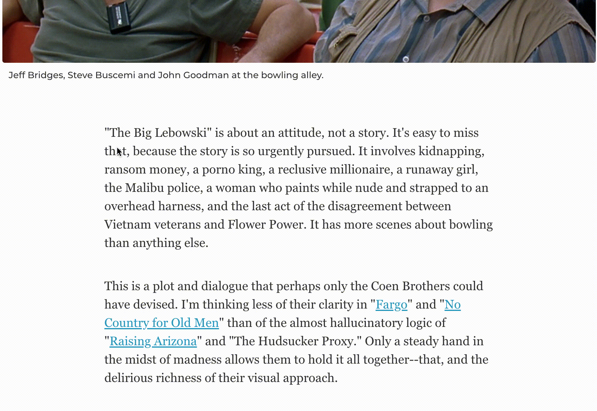
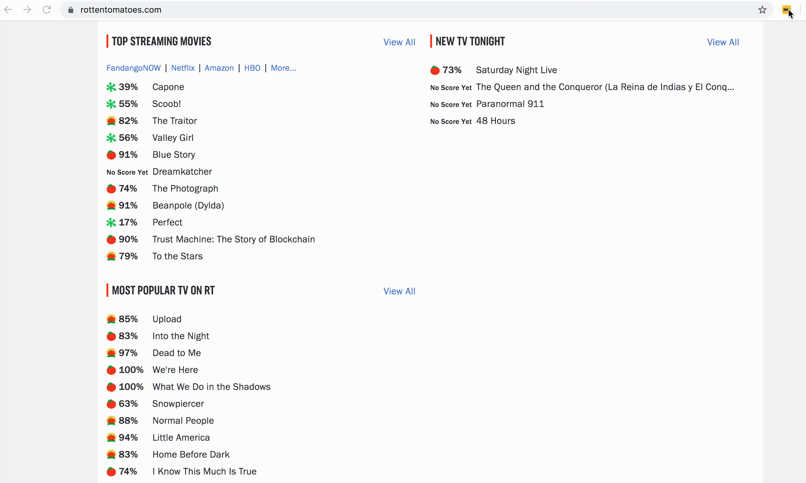

# IMDB-Lookup-Extension

Display IMDb rating from context menu and on rotten tomatoes. Follow the blog [here](https://www.arbazsiddiqui.me/building-your-first-chrome-extension-imdb-lookup/).

### HOW TO INSTALL : 

1. Clone this repo by `git@github.com:arbazsiddiqui/IMDB-Lookup-Extension.git && cd IMDB-Lookup-Extension`
2. Go to `chrome://extensions/` and toggle the `Developer mode` mode on.
3. Click on `Load unpacked` and browse to the directory containing the extension.

